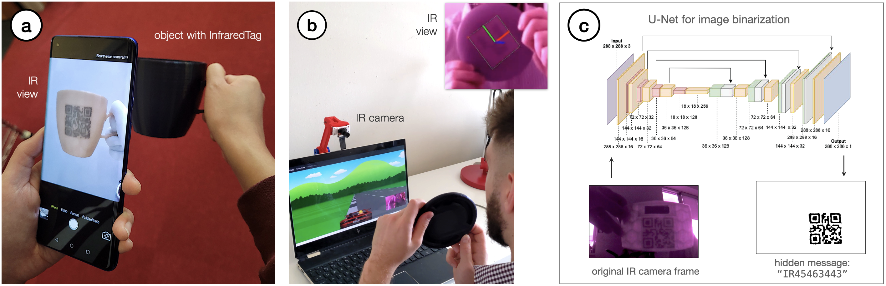
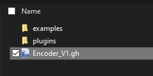

# InfraredTags: Invisible AR Markers and Barcodes

   In this tutorial, we show how InfraredTags can be fabricated and decoded using low-cost, infrared-based 3D printing and imaging tools. While any 2D marker can be embedded as InfraredTags, we demonstrate the process for QR codes and ArUco markers. This research project has been published at the [2022 ACM CHI](https://chi2022.acm.org/) Conference on Human Factors in Computing Systems. Learn more about the project [here](https://hcie.csail.mit.edu/research/infraredtags/infraredtags.html).
   
   <sub>By [Mustafa Doga Dogan](https://www.dogadogan.com/)\*, Ahmad Taka\*, Veerapatr Yotamornsunthorn\*, Michael Lu\*, [Yunyi Zhu](http://www.yunyizhu.info/)\*, Akshat Kumar\*, [Aakar Gupta](https://aakargupta.com/)†, [Stefanie Mueller](https://hcie.csail.mit.edu/stefanie-mueller.html)\*</sub>
   
   <sup>\*MIT and †Facebook Reality Labs</sup>
   
   The tutorial consists of three steps: (1) [embedding the marker into the 3D model of an object](#1-cad-adding-the-tag-into-the-object), (2) [3D printing the object](#2-fabrication-3d-printing-the-object), (3) [decoding the tag from the printed object](#3-detection-reading-the-tags). If you use InfraredTags as part of your research, please cite it as follows.
   
   > <sup>Mustafa Doga Dogan, Ahmad Taka, Michael Lu, Yunyi Zhu, Akshat Kumar, Aakar Gupta, and Stefanie Mueller. 2022. InfraredTags: Embedding Invisible AR Markers and Barcodes Using Low-Cost, Infrared-Based 3D Printing and Imaging Tools. In CHI Conference on Human Factors in Computing Systems (CHI '22). Association for Computing Machinery, New York, NY, USA, Article 269, 1–12. https://doi.org/10.1145/3491102.3501951 </sup>


<p align="center">
  
</p>
<sup>Our method allows users to embed (a) QR codes and (b) ArUco markers to store information in objects or to track them. The hidden markers are decoded from infrared camera images (c) using a convolutional neural network based on U-Net.</sup>

## #1 CAD: Adding the tag into the object
### Requirements
- Rhino 3D (make sure it is version 6) and [Grasshopper 3D](https://www.rhino3d.com/download/archive/rhino-for-windows/6/latest/)
        - Once installed, follow the instructions to install the [Pufferfish plugin](https://github.com/HCIELab/InfraTags/tree/main/public/encoder/plugins/Pufferfish3-0)
- Python and IDE (Any IDE will work, however, we use [PyCharm](https://www.jetbrains.com/pycharm/download/#section=windows))
- The instructions below are for the multi-material printing method, which gives the best results.
### Using the encoder
#### 1) Open the Encoder_V1.gh file
<p align="center">
  
</p>

#### 2) Import STL file (3D model)
<p align="center">
  
</p>

#### 3) Import SVG (2D tag/code)
   -  The SVGs have to be in a specific format in order for our Grasshopper code to parse it (see [section below](#svg-formating)).

<p align="center">
  
</p>

- Once imported you should see this:

<p align="center">
  
</p>
<sup>Rhino object with code embedded in it. Point is used to orient the code over the object.</sup>

#### 4) Move the tag as desired
   - Change the xyz coordinate of the point to move the code around on the surface of the object.
   - The best way to move a point is to simply set the coordinates by right clicking "Pt" on the inputs panel and then going to manage collection and typing a new point.
   - Due to a bug in the code, it is best to keep the point in the positive z-axis.


<p align="center">
  
</p>
<p align="center">
  
</p>


#### 5) Set top layer thickness and air gap (tag) thickness
   - We used 1.38mm and 1.92mm for White PLA and IR PLA, respectively.
   - However, we recommend that you calibrate these values by first printing a test checkerboard as shown in the CHI'22 paper.

#### 6) Export generated STLs:
   - For single-material, right click "single material" and click "bake". For multi-material, right click on both "multi material" and "IR filament".
   - A black wire mesh should appear in the perspective screen.
   - Simply highlight it with your mouse then navigate to File > Export selected and save somewhere in your file system.
   - Note: For multi-material, you need to bake and export each mesh separately. That way, you will have both the internal PLA component and the outer IR PLA component. 
<p align="center">
   
</p>
<p align="center">
   
</p>
<sup>Object mesh with code inside</sup>

<p align="center">
   
</p>
<sup>Code mesh</sup>

#### Important: SVG formating
   - To format the SVG you have two options:
      - Difficult: Take the original SVG and parse it into paths of the following format: ```<path d="Mx,yhavbh-az"></path>```
         - x,y are the starting position 
         - A is horizontal length, b is vertical length
         - Ex:  ```<path d="M0,0h5v6h-5z"></path>``` 
      - Easier solution: Use websites that generate the codes automatically and process them with our Python script:
         - For QR codes, use SVGs generated by this page (https://www.nayuki.io/page/qr-code-generator-library).
         - For ArUco, get SVGs from this page (https://chev.me/arucogen/). Save the SVG and pass it into the "Aruco_to_Path.py" file changing the paths in line 84 and 85.

## #2 Fabrication: 3D printing the object
#### Materials
   - Although our technique can be used with many filaments, we recommend using a standard white PLA for the tag, and IR PLA for the main geometry of the object including the top layer ([link to IR pla](https://3dk.berlin/en/special/115-pla-filament-ir-black.html)).
  
#### 1) Open the Cura slicer (or any slicer that supports multi-material prints)

#### 2) Import both models (IR PLA and regular PLA)

<p align="center">
   
</p>

#### 3) Arrange and slice   
    
<p align="center">
   
</p>

<sup>This is a preview of the object in Cura Slicer</sup>

<p align="center">
   
</p>
   
   Now you can send the job to the 3D printer!


## #3 Detection: Reading the tags
#### Materials
 - Raspberry Pi NoIR Camera [(link)](https://www.amazon.com/kuman-Raspberry-Camera-Module-Supports/dp/B0759GYR51/ref=sr_1_25?crid=IJE0D6SB8AQG&keywords=PI+noir+5MP&qid=1653020486&s=electronics&sprefix=pi+noir+5mp%2Celectronics%2C88&sr=1-25)
 - Raspberry Pi Zero [(link)](https://www.raspberrypi.com/products/raspberry-pi-zero/)
 - Micro-USB to USB type A cable [(link)](https://www.amazon.com/AmazonBasics-Male-Micro-Cable-Black/dp/B07232M876/ref=sr_1_3?keywords=micro+usb+to+usb&qid=1653020580&sr=8-3)
 - (Optional) 3D printed camera case to house all parts [(link)](https://github.com/HCIELab/InfraTags/tree/main/public/hardware/Camera_Case)
#### Hardware 
   - Once a Raspberry Pi and near-infrared camera are obtained, follow the instructions at this [link](https://tutorial.cytron.io/2020/12/29/raspberry-pi-zero-usb-webcam/) and follow the instructions to set up the pi + camera as a usb camera 
#### Software
   - It is recommend that you use pycharm to run the decoder demos both for QR and Aruco, however the code can be run from a terminal 
   - Have Python 3 and pip3 pre-installed on your system link for this is [here](https://www.python.org/downloads/) version 3.6 or greater should work just fine
   - Run the following command in terminal:
      - ```pip install opencv-python numpy dbr opencv-contrib-python pyzbar```
   - Or in pycharm navigate to File > Settings > Project > Python Interpreter > Install packages (click the plus sign) and install the following packages:
      - opencv-python 
      - numpy
      - dbr
      - opencv-contrib-python
      - pyzbar


## Using the decoder
### Reading QR codes
   - Navigate to qr_demo > qr_demo.py 
   - Open the file in an editor
   - Navigate to line 22 and confirm that CAMERA_STREAM is 1, indicating the usb camera
   - You should see a window popup in your screen if everything went alright 
   - There should also be a terminal outputting data on whether a code was detected or not
   
### Reading ArUco markers
   - Navigate to aruco_demo > aruco_demo.py
   - Open the file in an editor
   - Navigate to line 20 and confirm that CAMERA_STREAM is 1, indicating the usb camera
   - You should see a window popup in your screen if everything went alright
   - There should also be a terminal outputting data on whether a code was detected or not
  
### Calibrating the image transforms for ArUco markers
You should only do this if you want to change the parameters for the ArUco detection
   - Navigate to infrared_python_api and open irtags_calib.py 
   - Navigate to line 17 and confirm VIDEO_STREAM is 1 for the USB IR camera
   - A window with a panel should open on the right play around with the values until a code is detected 
   - Take note of these values, these values can be used to change the parameters for the image transforms
  
### Optional: Using a smartphone to decode the tags
   #### Hardware
   - OnePlus 8 Pro (found [here](https://www.oneplus.com/8-pro)) with Android 11. This phone has an embedded near-infrared camera. You can buy a used one from Amazon.

   #### Software
   - ADB shell ([installation guide](https://www.xda-developers.com/install-adb-windows-macos-linux/))
   - Follow the steps to enable wireless debugging on the OnePlus and pair with your PC ([here](https://medium.com/android-news/wireless-debugging-through-adb-in-android-using-wifi-965f7edd163a))
   
   #### Decoding
   - Once everything is installed, and you have paired the OnePlus phone to your computer via adb, you can run this command to get the IR camera show up:
   ```adb shell am start -n com.oneplus.factorymode/.camera.manualtest.CameraManualTest``` (more detail [here](https://www.xda-developers.com/oneplus-8-pro-color-filter-camera-still-accessible-adb-command/))
   - You should see the IR stream open on the OnePlus:
    <p align="center">  </p>
   - Note: if you do not see the IR camera, you may have to change the camera view to camera view 4 as seen in the top right of the image
   - It is important that once you are in camera view 4/IR camera view do not change views again. The app will freeze and you will need to restart the phone and resend the command to open the IR view again. 
   - Finally, after all this is done navigate to the oneplus folder ([here](https://github.com/HCIELab/InfraTags/tree/main/public/oneplus)) and run oneplus.py. This should open up a window on your PC, livestreaming the phone's screen.
  
### Important: QR code detection
 - All the demo code above for detecting QR codes uses [Dynamsoft Barcode Reader (DBR)](https://www.dynamsoft.com/barcode-reader/overview/) in the backend. Our code comes with a 1-day public trial license which must be renewed after expiration. 
 - If you do not renew the license, you will get only partial decoding of messages.
 - To update the license key navigate to the dbr_decode.py file for each demo and change the license key variable (line 4 of dbr_decode.py).
 
## #4 Setting up the USB Webcam


<p align="center">
   
</p>
<sup>Fully assembled custom IR camera module with IR LEDs</sup>

### Required hardware
<i>Optional items or tools are for the addition of IR LEDs</i>
- Raspberry PI Zero ([link]())
- NoIR Camera ([link]())
- 3 x 2mm Neodymium magnets ([link]())
- (Optional) 2 OSRam IR LEDs 451AS ([link]())
- (Optional) Male to Female Jumper Wires ([link]())
- Resistors ([link]())
- Wires ([link]())
- M3 screws and nuts ([link]())
- M2 screws and nuts ([link]())
- IR Filter ([link]())
### Tools
- Small Hammer 
- (Optional) Super Glue ([link]())
- (Optional) Soldering Iron and solder 
### 3D printing instructions
 - Print the STLs in the Camera Case V2 folder  (hardware > Camera_Case > STL > V2)
 - It is recommended you use 20% infill with any choice of filament
### Assembly Instructions without IR LEDs
 1) Once all things are printed use 4 hex M2x5mm screws and nuts to mount the camera to the camera mount 3D Printed Part
 2) Mount Raspberry Pi to the Camera Case Body using 4 M3x5mm screws and nuts 
 3) Plug the Camera into the Raspberry PI Zero making sure the cable stays within the Camera Case body
 4) Screw the camera mount into the main case for the Raspberry PI with M3x5mm screws
 5) Next we need to place the magnets in the case, to do this get a small hammer and gently place them into the holes at the top of the case and in the bottom of the filter mount. Make sure magnets in case and the mount are oppositely polarized! Take your time with this step there is no easy way to remove the magnets so If anything were to happen you may have to discard the case.
 6) Similarly to Step 5 place the magnets for filter cover. Again make sure the magnets between the cover and mount are oppositely polarized and take your time with this step.
 7) Next follow the instructions to make the PI a usb camera ([link](https://tutorial.cytron.io/2020/12/29/raspberry-pi-zero-usb-webcam/))
 8) If everything went well you should be able to place the filter mount on top of the main case housing the PI and then plug a usb into the PI and access the camera as a regular USB camera